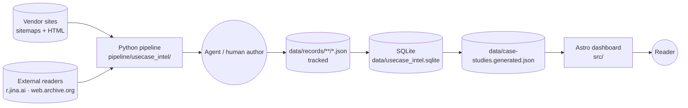
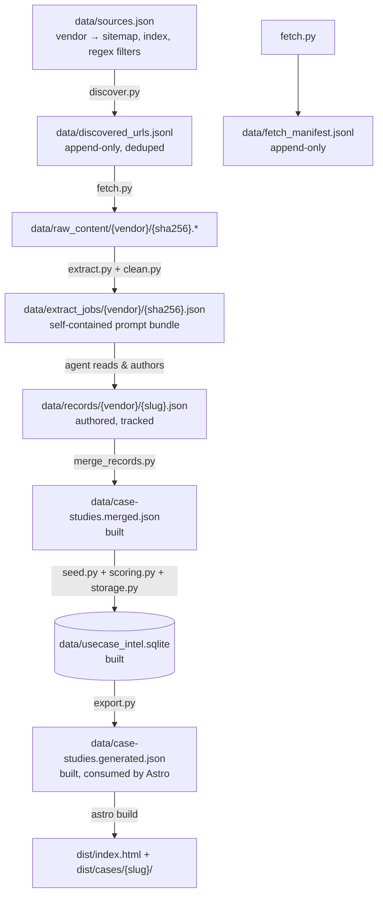

# System Architecture

This document describes **how** Customer Use Case Intelligence is built. For
the operational quickstart and command list see [README.md](README.md); this
file is the reference for anyone (human or agent) extending the system.

## 1. Goal in one paragraph

Turn vendor "customer story" pages (AWS / Microsoft / Google Cloud / Oracle /
Snowflake / Databricks / Alibaba Cloud / …) into a single, normalized,
queryable dataset so we can compare deployments across vendors, industries,
and use cases. The output is a static Astro dashboard plus a SQLite database
backed by per-record JSON files checked into the repo.

## 2. System context



Three runtimes cooperate by writing files into `data/`:

| Runtime | Where | What it does | Why this runtime |
| ------- | ----- | ------------ | ---------------- |
| **Python pipeline** | `pipeline/usecase_intel/` | Sitemap discovery, HTTP fetch, profile/reader/wayback fallback fetch, HTML→text, prompt bundle assembly, SQLite seeding, JSON export | One batch entry point with deterministic manifests and no manual fetch side path |
| **Astro dashboard** | `src/` | Static-site build of one index + N detail pages over the dataset | File-based routing, zero client JS by default, builds in <2 s |

`fetch.py` is the canonical batch entry point. `FetchClient` first uses the
configured project `User-Agent`, then can retry per-host profile strategies and
reader/wayback fallbacks while still writing the same raw HTML + manifest
contract.

## 3. End-to-end data flow

A single record's journey from a vendor page to the dashboard:



Every arrow is **idempotent**: rerunning a step skips inputs already
processed (by URL, by SHA, by record id). That makes the whole pipeline
resumable — kill it mid-run, fix a bug, rerun.

### Why each stage exists

- **discover** isolates URL enumeration from fetching. A 415-URL Databricks
  sitemap is cheap to walk; fetching 415 pages is not. Keeping them separate
  lets us re-filter / re-cap candidates without re-fetching.
- **fetch** is single-threaded with per-host delay and an always-on fallback
  chain. It writes raw response bytes by SHA so identical bodies dedupe naturally on disk.
- **clean/media → extract** turns fetched content into a self-contained prompt bundle:
  source URL, cleaned text, article-scoped visual candidates with local assets,
  the taxonomy, and the extraction SKILL.md inlined. The bundle is the **agent
  contract** — anyone (or any agent) can read it without further context.
- **records** are authored once per page and committed. They are the source
  of truth.
- **merge → seed → export** is deterministic projection: take the authored
  records, fold in samples, normalize, score, store, dump back as a single
  JSON for the dashboard.

## 4. Agent-in-the-loop design (the unusual part)

Most extraction pipelines call an LLM API in step 4 and write JSON to disk.
This one **stops at the prompt bundle** and lets the agent (the current
conversation) read the bundle and write the JSON file by hand.

Why:

- **No API key, no provider lock-in.** The bundle is a plain JSON file; any
  capable agent or human can fulfil it.
- **Full evidence trail.** The agent quotes the page back into
  `evidence_quotes` while writing the record, so reviewers can verify each
  claim without re-fetching.
- **Taxonomy enforcement happens at author time, not as a post-hoc filter.**
  The bundle inlines `taxonomy.json`, so the author picks legal categories
  from the same vocabulary the dashboard understands.
- **Cheap regression**: a corrupt extraction is fixed by editing one
  `data/records/…/{slug}.json`; nothing else has to rerun until
  `npm run data:build`.

The downside: extraction throughput is bounded by the agent. This is a
deliberate trade-off — the dataset prizes signal-to-noise over volume.

## 5. Component-level breakdown

### Python pipeline (`pipeline/usecase_intel/`)

| Module | Responsibility | Key invariants |
| ------ | -------------- | -------------- |
| [`settings.py`](pipeline/usecase_intel/settings.py) | Shared path and runtime defaults for command modules | One place for data paths, skill/taxonomy paths, user agent, delay, and host strategy config |
| [`utils.py`](pipeline/usecase_intel/utils.py) | Small shared helpers: slugify, JSONL load, and JSON load/write | Keeps command modules thin and consistent |
| [`fetch_client.py`](pipeline/usecase_intel/fetch_client.py) | `FetchClient`: stdlib `urllib.request`, per-host rate limit, optional disk cache by URL SHA, profile/reader/wayback fallback fetching | Single-threaded; never bursts; sets `User-Agent` from `sources.json`; fallbacks are always enabled |
| [`discover.py`](pipeline/usecase_intel/discover.py) | Walk sitemap index → child sitemaps → urls. Walk vendor "index pages" for `<a href>` candidates. Apply include/exclude regexes. Cap with `--enough` early-exit. | Output is append-only JSONL; reruns dedupe against existing rows |
| [`fetch.py`](pipeline/usecase_intel/fetch.py) | For each unfetched URL in `discovered_urls.jsonl`, fetch and write `raw_content/{vendor}/{sha256}.*` plus a `fetch_manifest.jsonl` line | Skip if URL already in manifest with `status == 200` unless `--refresh`; records `retrieval_source` and `profile` for diagnostics |
| [`clean.py`](pipeline/usecase_intel/clean.py) | `content_to_text(bytes) → (title, body, method)`. Uses BeautifulSoup for HTML main-content cleanup, pypdf for PDFs, and stdlib fallbacks for malformed HTML/plain text | One Python text extraction path for origin HTML, reader text, archived HTML, and PDFs |
| [`media.py`](pipeline/usecase_intel/media.py) | `extract_related_images(bytes) → related_images[]` and `materialize_related_images(...)`. Discovers article `img`/`picture`/`source`, low-confidence CSS background images, inline SVG, and metadata images; scores visible context plus decoded URL/file-name hints, filters low-value candidates, and requires useful hints for non-diagram images before attempting a bounded local asset plan | Agents can inspect local `local_path` images instead of reparsing HTML or fetching remote assets by hand; failed downloads remain annotated with `asset_error` and do not consume the asset budget |
| [`extract.py`](pipeline/usecase_intel/extract.py) | Read manifest, run `clean` + `media`, assemble prompt bundle `{vendor, source_url, sha256, title, raw_path, content_type, retrieval_source, profile, extraction_method, related_images, prompt, created_at}` | Each bundle is self-sufficient: inlines SKILL.md + taxonomy.json + cleaned text and carries local article visual assets for diagram extraction |
| [`probe.py`](pipeline/usecase_intel/probe.py) | Probe origin profiles, reader, and wayback for hard URLs; optionally update the host strategy map | Uses the same public fetch attempt API as `FetchClient` |
| [`models.py`](pipeline/usecase_intel/models.py) | `load_records(path) → list[dict]` with `normalize_record` validation | Required string fields must be non-empty strings; required list fields must be lists of strings |
| [`scoring.py`](pipeline/usecase_intel/scoring.py) | `compute_maturity_score(record) → 0–6`, `compute_confidence_score(record) → 0–1` | Pure functions of field presence; deterministic |
| [`storage.py`](pipeline/usecase_intel/storage.py) | `initialize_database`, `upsert_records`. Schema: `case_studies` (1 row per record) + `case_study_values` (KV table for multi-value fields keyed by `kind`) | All multi-value fields have a single `MULTI_VALUE_FIELDS` mapping; `raw_json` stores the canonical record |
| [`merge_records.py`](pipeline/usecase_intel/merge_records.py) | Walk `data/records/**/*.json`, optionally fold in samples, dedupe by `id`, write a single array | Real records override sample placeholders on `id` collision |
| [`seed.py`](pipeline/usecase_intel/seed.py) | `enrich_scores` + `upsert_records` | Computes scores if missing; never overwrites a score the author set |
| [`export.py`](pipeline/usecase_intel/export.py) | Round-trip records out of SQLite, reattaching multi-value lists via the KV table | Order is `vendor, customer_name` for deterministic diffs |

### Astro dashboard (`src/`)

| File | Responsibility |
| ---- | -------------- |
| [`src/pages/index.astro`](src/pages/index.astro) | Dashboard: hero stats, top-use-cases / top-products bars, outcomes chip cloud, maturity stack, vendor × use-case + industry × use-case matrices, filterable record table |
| [`src/pages/cases/[slug].astro`](src/pages/cases/[slug].astro) | Per-record detail. `getStaticPaths` generates one route per record |
| [`src/layouts/BaseLayout.astro`](src/layouts/BaseLayout.astro) | Site chrome. Banner is dynamic: real vs sample counts come from `caseStudies` so the UI never lies |
| [`src/lib/caseStudies.ts`](src/lib/caseStudies.ts) | The single import point for the dataset (`data/case-studies.generated.json`). If you want to read records anywhere in `src/`, import from here |
| [`src/lib/analytics.ts`](src/lib/analytics.ts) | Pure aggregation helpers: `uniqueSorted`, `flattenValues`, `countValues`, `topValues`, `buildMatrix`, `averageConfidence`, `maturityDistribution`, `formatPercent`, `formatDate` (defensive — unparseable dates fall through to the raw string), `isParseableDate` |
| [`src/lib/types.ts`](src/lib/types.ts) | `CaseStudyRecord` and dashboard view models. **The TypeScript schema is the single source of truth that has to stay in sync with `models.py` and `storage.py`.** |
| [`src/styles/global.css`](src/styles/global.css) | All styling. Hand-rolled CSS; no Tailwind. Tokens derived from the Miro design system reference in `DESIGN.md`. |

The dashboard intentionally has no client-side data fetching. The full
dataset is inlined at build time, so every page is a static HTML file in
`dist/`.

### Agent skills (`.agents/skills/`)

| Skill | Role |
| ----- | ---- |
| [`case-study-extraction`](.agents/skills/case-study-extraction/SKILL.md) | The contract for step 4 (record authoring). Inlined into every `data/extract_jobs/**/*.json` bundle so the prompt is portable. |

## 6. Key contracts

### `CaseStudyRecord` (the record schema)

Defined in [`src/lib/types.ts`](src/lib/types.ts) and validated in
[`models.py`](pipeline/usecase_intel/models.py). Mirror them when changing
either side.

```ts
interface SolutionComponent {
  name: string;                // exact product name as written in source
  role: string;                // one-line role in this specific deployment
  layer?: string;              // taxonomy.component_layers value
}

interface CaseStudyRecord {
  id: string;                    // stable; record path of truth
  slug: string;                  // URL slug; must be unique
  vendor: string;                // from taxonomy.vendors
  customer_name: string;
  industry: string;              // from taxonomy.industries
  region: string;
  company_size: string;          // "Enterprise" | "Mid-market" | "SMB" | "Public sector" | "Unknown"
  business_problem: string;
  solution_summary: string;      // 600–1000 chars; covers ingest → process → store → serve
  products_used: string[];       // flat list; mirrors solution_components[].name
  solution_components?: SolutionComponent[];   // structured per-component view (new)
  data_flow?: string;            // optional end-to-end narrative (new)
  integration_points?: string[]; // optional external systems / upstream / downstream (new)
  technical_area: string[];      // from taxonomy.technical_areas
  use_case_category: string[];   // from taxonomy.use_case_categories
  business_outcome: string;
  outcome_category: string[];    // from taxonomy.outcome_categories
  metrics: string[];             // raw quantitative claims with units
  architecture_clues: string[];  // free-form bag for short technical notes
  source_url: string;
  published_date: string;        // ISO date or "unknown"
  confidence_score: number;      // 0–1
  maturity_score: number;        // 0–6
  evidence_quotes: string[];     // verbatim spans backing the extraction
  is_sample?: boolean;           // true for synthetic seeds
}
```

The optional fields (`solution_components`, `data_flow`, `integration_points`)
give solution depth without breaking older records: the dashboard falls back
to the flat `products_used` chip list when `solution_components` is absent,
and simply hides the data-flow / integration sections when empty.

### `data/sources.json` (vendor source config)

```jsonc
{
  "user_agent": "UseCaseIntelBot/0.1 (+…)",
  "default_delay_seconds": 1.0,
  "sources": [
    {
      "vendor": "Databricks",
      "sitemaps":  ["https://www.databricks.com/en-customer-assets/sitemap/sitemap-index.xml"],
      "index_pages": [],
      "url_patterns":    ["^https://www\\.databricks\\.com/customers/[^/]+/?$"],
      "exclude_patterns":["/(gen-ai|your-ai|champions-program|solutions-accelerator-general|all)/?$"]
    }
  ]
}
```

### `data/fetch_manifest.jsonl` (one line per attempt)

```json
{"vendor":"Oracle","url":"…","final_url":"…","raw_path":"data/raw_content/oracle/<sha>.html",
 "status":200,"sha256":"…","content_type":"text/html; charset=utf-8",
 "retrieval_source":"origin","profile":"desktop-chrome",
 "fetched_at":"2026-05-16T…","from_cache":false,"error":null}
```

### `host-strategies.json` (fetch fallback memory)

Per-host best-known fetch strategy so future Python fetches skip the profile probe.
Stored at `pipeline/usecase_intel/config/host-strategies.json`. See entries
for `www.databricks.com` and `www.snowflake.com` for the two
patterns we use: **happy path** (`strategy: <profile>`, optional `note`) and
**known SPA / known-blocker** (`strategy: null` with a `note` describing
why).

### `taxonomy.json` (controlled vocabulary)

10 vendors · 13 industries · 15 technical areas · 15 use case categories ·
8 outcome categories · 6 component layers (`Ingest`, `Compute`, `Storage`,
`Serving`, `Orchestration`, `Governance`). Authoring outside this list is a
soft error today (not yet enforced — see §9).

## 7. Storage and tracking policy

| Path | Tracked? | Why |
| ---- | -------- | --- |
| `data/sources.json` | yes | Source config — code-like |
| `data/case-studies.sample.json` | yes | Synthetic seeds; small, useful as fixtures |
| `data/records/**/*.json` | yes | Authored records are the source of truth |
| `data/discovered_urls.jsonl` | no | Easily regenerable; grows large |
| `data/raw_content/` | no | Easily refetched; can be large |
| `data/fetch_manifest.jsonl` | no | Per-machine fetch log |
| `data/extract_jobs/` | no | Derived bundles |
| `data/case-studies.merged.json` | no | Build artifact |
| `data/case-studies.generated.json` | no | Build artifact (dashboard input) |
| `data/usecase_intel.sqlite` | no | Build artifact |
| `data/http_cache/` | no | Pipeline fetch cache |

Rule of thumb: anything that can be regenerated by running the pipeline is
gitignored.

## 8. Extension recipes

### Add a new vendor

1. Append a `sources[]` entry to `data/sources.json` with sitemaps, index
   pages (optional), `url_patterns`, and `exclude_patterns`.
2. Add the vendor name to `taxonomy.json` → `vendors`.
3. Run `npm run data:discover -- --vendor "<name>"`. Inspect
   `data/discovered_urls.jsonl` — adjust regexes until candidates look
   right.
4. Run `npm run data:fetch -- --vendor "<name>"`.
5. Run `npm run data:extract -- --vendor "<name>"`.
6. For each bundle: open it, read the cleaned text, follow the
   [`case-study-extraction`](.agents/skills/case-study-extraction/SKILL.md)
   skill, write `data/records/<vendor_slug>/<slug>.json`.
7. `npm run data:build` to rebuild the database and the dashboard JSON.

### Add a dashboard view

1. Pure aggregation goes in [`src/lib/analytics.ts`](src/lib/analytics.ts)
   as a new function over `CaseStudyRecord[]`.
2. Wire it into [`src/pages/index.astro`](src/pages/index.astro) as a new
   `<section>`. Reuse the `.surface-card`, `.feature-grid`, `.bar-list`,
   `.matrix-table` classes from `global.css` for visual consistency.
3. No build wiring needed — Astro picks up new sections automatically.

### Add a taxonomy category

1. Append to the relevant array in `taxonomy.json`.
2. Existing records pick it up automatically when the agent re-authors with
   the new bundle; old records keep their old categories until re-extracted.

## 9. Known design debt

Things the current implementation does **not** do, knowingly:

- **Generated ledgers are disposable.** If manifest or raw-content formats change,
  rerun discovery/fetch/extract instead of preserving compatibility shims.
- **No taxonomy validation at extraction time.** `models.py` checks field
  shape but not values. Free-form drift (e.g. `Cloud Native` vs
  `Cloud-Native`) silently leaks into the dashboard's facet selector and
  coverage matrix. Adding `validate_against_taxonomy(record, taxonomy)` in
  `models.py` is a small change and is on the roadmap.
- **`extract.py` truncates at 18000 chars.** Long pages may lose the
  metrics / architecture paragraphs near the end. Switching to a
  "head + tail" or "paragraph-aware" trim is queued.
- **`maturity_score` ceiling is hard-coded in three places** (`scoring.py`,
  `[slug].astro`, `maturityLabel()`). Hoist to a shared constant once.
- **No automated tests.** The dataset itself is the regression suite for
  now — `npm run build` will fail if `formatDate` or `getStaticPaths` chokes
  on a malformed record. Real tests come when behaviour stabilises.

These are intentional gaps, not unknowns. See the matching section in
[README.md](README.md) for the user-visible status.

## 10. Diagram of how files map to disk

```
usecase/
├── README.md                              quickstart
├── ARCHITECTURE.md                        this file
├── DESIGN.md                              external Miro design-system reference
├── taxonomy.json                          controlled vocabulary
├── astro.config.mjs · tsconfig.json · package.json
├── public/                                static assets served as-is
├── src/
│   ├── layouts/BaseLayout.astro
│   ├── lib/{analytics,caseStudies,types}.ts
│   ├── pages/index.astro · cases/[slug].astro
│   └── styles/global.css
├── pipeline/usecase_intel/                Python pipeline (one module per stage)
├── .agents/skills/case-study-extraction/  extraction contract
└── data/
    ├── sources.json                       vendor source config (tracked)
    ├── records/<vendor>/<slug>.json       authored records (tracked)
    ├── case-studies.sample.json           seeds (tracked)
    ├── discovered_urls.jsonl              build artifact
    ├── raw_content/<vendor>/<sha>.*       build artifact
    ├── fetch_manifest.jsonl               build artifact
    ├── extract_jobs/<vendor>/<sha>.json   build artifact
    ├── case-studies.merged.json           build artifact
    ├── case-studies.generated.json        dashboard input (build artifact)
    └── usecase_intel.sqlite               build artifact
```

Track changes to this file when you change any of: the data flow (§3), the
component responsibilities (§5), the schema (§6), or the tracking policy
(§7). The point of the doc is to stay accurate.
